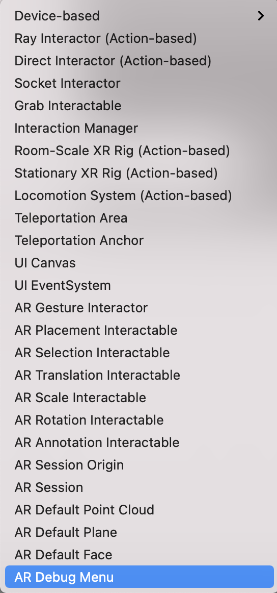
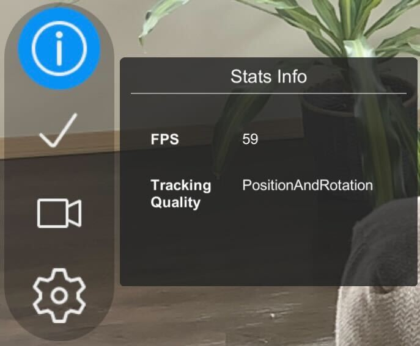
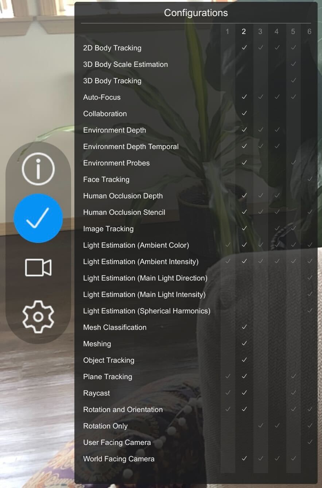
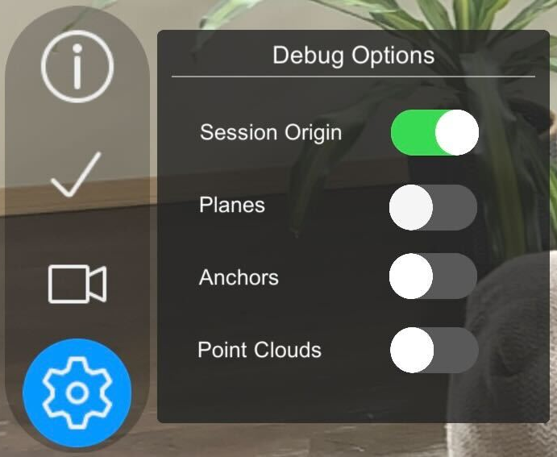

# AR Foundation Debug menu

You can add the AR Foundation Debug menu to an AR scene to add a menu of tracking information and available configurations. When that scene is active on a target device, you can use the menu to view the following information:

- Stats Info
    - FPS
    - Tracking Mode
- Session Configurations
- Debug Options
    - XR Origin
    - Planes
    - Anchors
    - Point Clouds

The AR Debug menu works with any scene that contains an [`ARSession`](xref:UnityEngine.XR.ARFoundation.ARSession), an [`XROrigin`](xref:Unity.XR.CoreUtils.XROrigin), and a [`Camera`](https://docs.unity3d.com/Manual/class-Camera.html).

The Debug menu is a Prefab object containing the [`ARDebugMenu`](xref:UnityEngine.XR.ARFoundation.ARDebugMenu) script and a set of GameObjects and components that provide the UI. See [Setting up the menu](#setting-up-the-menu) for instructions to add the Debug menu to a scene.

# Setting up the menu

To create an out-of-the-box fully configured debug menu, right-click anywhere in the Hierarchy window and select **XR** &gt; **AR Debug Menu**.

Right-click in the Hierarchy window       |  Select XR
:-------------------------:|:-------------------------:
  |  

The AR Debug menu appears as a toolbar that is anchored either to the left or bottom side of the screen.

# Features

## Stats Info
The Stats Info tab provides general information about a session, including current FPS and [`TrackingMode`](xref:UnityEngine.XR.ARFoundation.TrackingMode).

 *Stats Info tab*

## Session Configurations
The Session Configurations tab displays all the available session [`Configurations`](xref:UnityEngine.XR.ARSubsystems.Configuration) for a specific platform and highlights the currently active configuration.

 *Session Configurations tab*

## Debug Options
The Debug Options tab allows the user to toggle visualizers for various [ARTrackables](xref:UnityEngine.XR.ARFoundation.ARTrackable) in the scene.

 *Debug Options tab*
