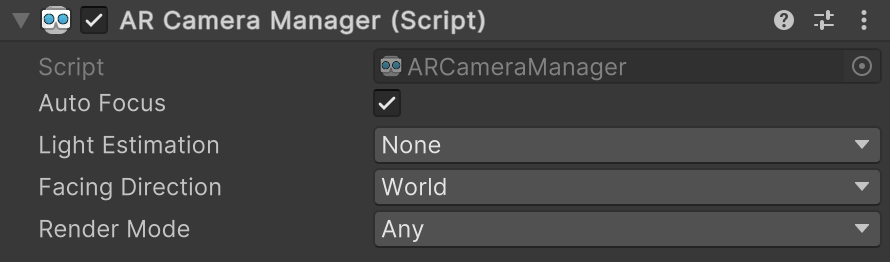
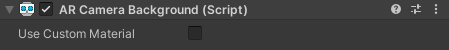

# Camera components

AR Foundation uses two primary components to control device camera functionality in your AR scene: [ARCameraManager](xref:UnityEngine.XR.ARFoundation.ARCameraManager) and [ARCameraBackground](xref:UnityEngine.XR.ARFoundation.ARCameraBackground). Your scene should contain at most one of each of these components enabled at a time. After initial [scene setup](xref:arfoundation-scene-setup) you can find AR Camera Manager and AR Camera Background components in the XR Origin GameObject hierarchy at **XR Origin** > **Camera Offset** > **Main Camera**.

## Platform support

AR Foundation cameras are supported on iOS and Android as indicated by the table below. On platforms that don't support the camera feature, the AR Camera Manager and AR Camera Background components will simply disable themselves in their OnEnable implementation.

| Provider plug-in         | Camera supported | Provider documentation |
| :----------------------- | :--------------: | :--------------------- |
| Google ARCore XR Plug-in |        Yes       | [Camera](https://docs.unity3d.com/Packages/com.unity.xr.arcore@5.0/manual/arcore-camera.html) (ARCore) |
| Apple ARKit XR Plug-in   |        Yes       | [Camera](https://docs.unity3d.com/Packages/com.unity.xr.arkit@5.0/manual/arkit-camera.html) (ARKit) |
| OpenXR Plug-in           |        No        | |

# AR Camera Manager component

The [ARCameraManager](xref:UnityEngine.XR.ARFoundation.ARCameraManager) component is a [manager](xref:arfoundation-managers) that enables or disables the device camera when the component is enabled or disabled, respectively, and gives you a scripting interface for camera-related features.

 *AR Camera Manager component*

| Property | Description |
| :------- | :---------- |
| **Auto Focus** | Enables or disables a request to use the camera's automatic focus mode. When disabled, fixed focus mode is used. Availability of **Auto Focus** depends on camera hardware. |
| **Light Estimation** | Estimates lighting properties of the environment. There are five options: <ul><li><strong>Ambient Intensity:</strong> Estimates the overall average brightness</li><li><strong>Ambient Color:</strong> Estimates the overall average color</li><li><strong>Ambient Spherical Harmonics:</strong> Estimates the [spherical harmonics](https://en.wikipedia.org/wiki/Spherical_harmonic_lighting) describing the scene. Spherical harmonics are used to produce more realistic lighting calculations.</li><li><strong>Main Light Direction:</strong> Estimates the direction of the primary light source. The direction points away from the light (so that it matches the light's direction).</li><li><strong>Main Light Intensity:</strong> Estimates the brightness of the primary light source.</li></ul>While you can request any of these simultaneously, support for each of these varies greatly among devices. Some platforms may not be able to be simultaneously provide all options, or it may depend on other features (for example, camera facing direction). |
| **Facing Direction** | Controls which camera is used. This value can be either **World** or **User**. On handheld mobile devices like phones and tablets, **World** refers to the rear camera and **User** refers to the front-facing ("selfie") camera. |
| **Render Mode** | Sets the `ARCameraManager`'s [requestedBackgroundRenderingMode](xref:UnityEngine.XR.ARFoundation.ARCameraManager.requestedBackgroundRenderingMode), which specifies the stage in Unity's render pipeline that the AR camera background is rendered. There are three options:<ul><li><strong>Any:</strong> Let the camera provider decide when to render the background.</li><li><strong>Before Opaques:</strong> Render the full camera background before opaque geometry. This is the default behavior on Android and iOS.</li><li><strong>After Opaques:</strong> Selectively render the camera background after opaque geometry, rendering only pixels that are not occluded by opaque geometry in the scene. If your scene occludes a significant portion of the background with opaque geometry, this render mode can be an optimization to reduce overdraw.</li></ul> |

> [!NOTE]
> <strong>After Opaques</strong> has slightly different rendering behavior beyond its render order. <strong>After Opaques</strong> also causes `ARCameraBackground` to render a fullscreen quad at the Camera's [farClipPlane](xref:UnityEngine.Camera.farClipPlane) to ensure that depth testing properly culls fragments that are behind opaque geometry.

# AR Camera Background component

The [ARCameraBackground](xref:UnityEngine.XR.ARFoundation.ARCameraBackground) component renders video from the device camera as the background of the scene. Enable this component to render the AR background, and disable it to disable background rendering.

 *AR Camera Background component*

| Property | Description |
| :------- | :---------- |
| **Use Custom Material** | If you set **Use Custom Material** to **true**, `ARCameraBackground` uses the **Custom Material** you specify to render the background. |
| **Custom Material** | Only visible if **Use Custom Material** is **true**. Set this property to use your own shader to render the background. AR Foundation uses the Material from the active provider plug-in by default, but you can override the default with your own Material. |

[!include]
