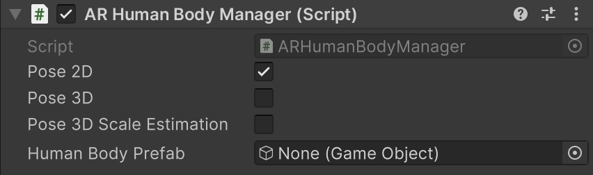

# Body Tracking

To enable body tracking in an AR scene, add an [ARHumanBodyManager](xref:UnityEngine.XR.ARFoundation.ARHumanBodyManager) component to the XR Origin.

# AR Human Body Manager component

The [ARHumanBodyManager](xref:UnityEngine.XR.ARFoundation.ARHumanBodyManager) component enables human body tracking in an AR scene.

 *AR Human Body Manager component*

| Property | Description |
| :------- | :---------- |
| **Pose 2D** | Whether to estimate the 2D pose for any human bodies detected. |
| **Pose 3D** | Whether to estimate the 3D pose for any human bodies detected. |
| **Pose 3D Scale Estimation** | Whether to estimate 3D human body scale. |
| **Human Body Prefab** | The Prefab to instantiate at the origin for the detected human body. |
