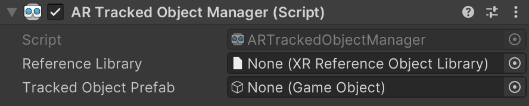
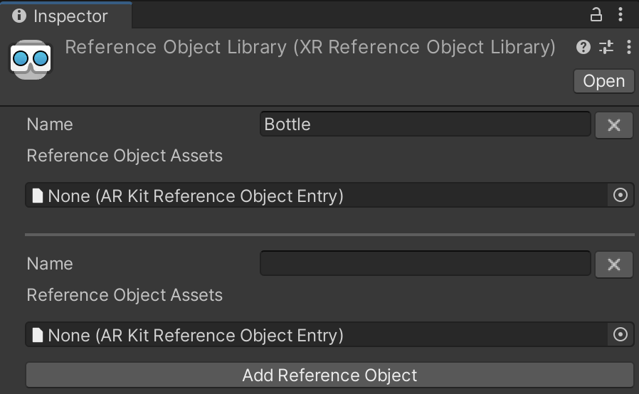

# AR Tracked Object Manager component

The [ARTrackedObjectManager](xref:UnityEngine.XR.ARFoundation.ARTrackedObjectManager) component is a type of [trackable manager](xref:arfoundation-managers#trackables-and-trackable-managers).

<br/>*AR Tracked Object Manager component*

The tracked object manager creates a GameObject for each object detected in the environment. Before a real-world object can be detected, you must scan it to create a reference object. You can then add the reference object to the tracked object manager's reference object library.

> [!NOTE]
> * Currently, the [Apple ARKit XR Plug-in](xref:arkit-object-tracking) is the only Unity-supported provider plug-in that implements object tracking. 
> * The [Scanning and Detecting 3D Objects](https://developer.apple.com/documentation/arkit/scanning_and_detecting_3d_objects) page on Apple's developer website allows you to download an app that you can use on an iOS device to produce such a scan. Note that this is a third-party application, and Unity is not involved in its development.

## Terminology

|**Term**|**Description**|
|--------|---------------|
|**Reference object**|A reference object is an object that you have previously scanned and stored in a reference object library. The object tracking subsystem detects and tracks instances of the object in the environment.|
|**Reference object library**|A reference object library is an asset containing a collection of reference objects.|

## Create a reference object library

In a typical object tracking workflow, you create a reference object library in the Editor and then populate the library with reference objects. You must add a provider-specific entry for each provider plug-in your project that supports object tracking. 

To create a reference object library, right click in the Project window and select **Assets** &gt; **Create** &gt; **XR** &gt; **Reference Object Library**.

This creates a new `ReferenceObjectLibrary` asset in your project. To add a reference object to the library, select this asset, then click **Add Reference Object**:

<br/>*A reference object library*

Each reference object has a **Name**, followed by a list of provider-specific entries, which are required in order for object detection to work on device. In the example above, each object has one entry for the ARKit provider. 

The asset format for a reference object entry depends on the provider implementation. The [Apple ARKit XR Plug-in](xref:arkit-object-tracking) uses the `.arobject` format defined by Apple. See the [Scanning and Detecting 3D Objects](https://developer.apple.com/documentation/arkit/scanning_and_detecting_3d_objects) page on Apple's developer website for more information.

## Use a reference object library at runtime

The simplest way to use a reference object library is to save its reference to the tracked object manager's **Reference Library** field via the Inspector. However, you can also create and use a new reference object library at runtime as shown below:

```csharp
XRReferenceObjectLibrary myLibrary = ScriptableObject.CreateInstance(typeof(XRReferenceObjectLibrary));
GetComponent<ARTrackedObjectManager>().referenceLibrary = myLibrary;
```

If your project uses the object tracking subsystem without an [ARTrackedObjectManager](xref:UnityEngine.XR.ARFoundation.ARTrackedObjectManager), you can also set the reference object library directly via the subsystem's `library` property. In this case, make sure to assign the reference library to the subsystem's `library` property before you start the subsystem.

### Add a reference object at runtime

To add a new reference object to a reference object library at runtime, follow the steps shown in the example below:

```csharp
// Create an XRReferenceObject
var referenceObject = new XRReferenceObject("My reference object");

// Add provider-specific entry data to the reference object
referenceObject.AddEntry(arobject);

// Add the reference object to the manager's reference object library
GetComponent<ARTrackedObjectManager>().referenceLibrary.Add(referenceObject);
```

## Create a manager at runtime

When you add a component to an active GameObject at runtime, Unity immediately invokes the component's `OnEnable` method. However, the `ARTrackedObjectManager` requires a non-null reference object library. If the reference object library is null when the [ARTrackedObjectManager](xref:UnityEngine.XR.ARFoundation.ARTrackedObjectManager) is enabled, it automatically disables itself.

To add an [ARTrackedObjectManager](xref:UnityEngine.XR.ARFoundation.ARTrackedObjectManager) at runtime, set its reference object library and then re-enable it:

```csharp
var manager = gameObject.AddComponent<ARTrackedObjectManager>();
manager.referenceLibrary = myLibrary;
manager.enabled = true;
```

## Tracked object Prefab

This Prefab is instantiated whenever an object from the reference object library is detected. The manager ensures the instantiated GameObject includes an `ARTrackedObject` component. You can get the reference object that was used to detect the `ARTrackedObject` with the `ARTrackedObject.referenceObject` property.

[!include[](../snippets/apple-arkit-trademark.md)]
