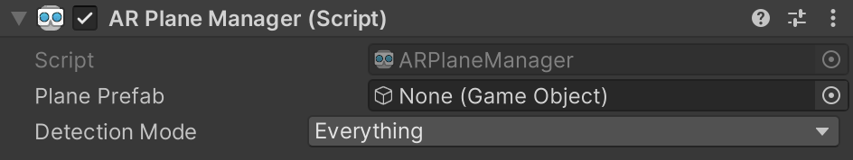

# AR Plane Manager component

The plane manager is a type of [trackable manager](xref:arfoundation-managers#trackables-and-trackable-managers).

<br/>*AR Plane Manager component*

The plane manager creates GameObjects for each detected plane in the environment. A plane is a flat surface represented by a pose, dimensions, and boundary points. The boundary points are convex.

Examples of features in the environment that can be detected as planes are horizontal tables, floors, countertops, and vertical walls.

You can specify a **Detection Mode**, which can be horizontal, vertical, or both. Some platforms require extra work to perform vertical plane detection, so if you only need horizontal planes, you should disable vertical plane detection.

<br/>*AR Plane Manager Detection Mode dropdown*

## Plane life cycle

Planes can be added, updated, and removed. Once per frame, the AR plane manager can invoke the `planesChanged` event with `List`s of planes that have been added, updated, and removed since the last frame.

When a plane is first detected, the plane manager reports it as "added". Subsequent updates to the plane are refinements on this initial plane detection. A plane typically grows as you scan more of the environment.

When a plane is updated, it's likely that its boundary vertices have also changed. To respond to this event, subscribe to the plane's `ARPlane.boundaryChanged` event. This event only fires if at least one boundary vertex has changed by at least the **Vertex Changed Threshold**, or if the total number of vertices changes.

When a plane is removed, it generally doesn't mean a surface has been removed, but rather that the subsystem's understanding of the environment has improved or changed in a way that invalidates that plane.

Some platforms support the concept of planes merging. If a plane is merged into another one, the [ARPlane.subsumedBy](xref:UnityEngine.XR.ARFoundation.ARPlane.subsumedBy) will contain the plane which subsumed the plane in question. Not all platforms support this. Some might remove one plane and make another plane larger to encompass the first.

## Visualizing planes

To visualize planes, you need to create a Prefab or GameObject which includes a component that subscribes to [ARPlane](xref:UnityEngine.XR.ARFoundation.ARPlane)'s `boundaryChanged` event. AR Foundation provides an `ARPlaneMeshVisualizer`. This component generates a `Mesh` from the boundary vertices and assigns it to a `MeshCollider`, `MeshFilter`, and `LineRenderer`, if present.

To create a new GameObject which you can then use to create your Prefab, right-click in your Scene view and select **GameObject** &gt; **XR** &gt; **AR Default Plane** from the context menu that appears.


After you create the GameObject, assign it to the `ARPlaneManager`'s `Plane Prefab` field. You can use it directly or create a Prefab by dragging the GameObject into your Assets folder. The default plane looks like this:


It is recommended to save the `AR Default Plane` as a Prefab first, delete the `AR Default Plane` GameObject, and then use that in the Orefab field, because leaving the plane in your scene leaves a zero scale plane artifact in the scene.


The AR Foundation package includes these components for ease of use, but you can create your own visualizers (or other logic) as you want.

## Disabling planes

As long as the AR Plane Manager is enabled, it continues to create, update, and remove planes. To stop rendering existing planes, deactivate their GameObjects like this:

```csharp
foreach (var plane in planeManager.trackables)
{
    plane.gameObject.SetActive(false);
}
```

You shouldn't `Destroy` an `ARPlane` while the plane manager is still managing it.
