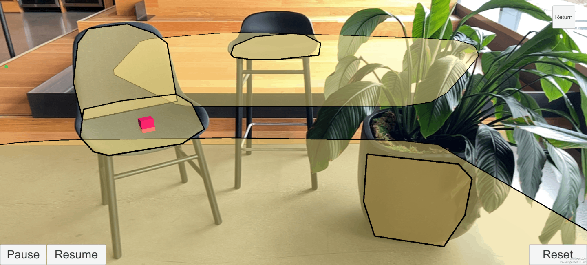

# AR Foundation

AR Foundation enables you to create multi-platform augmented reality (AR) apps with Unity. In an AR Foundation project, you choose which AR features to enable by adding the corresponding manager components to your scene. When you build and run your app on an AR device, AR Foundation enables these features using the platform's native AR SDK, so you can create once and deploy to the world's leading AR platforms.

 *The [Simple AR sample](https://github.com/Unity-Technologies/arfoundation-samples#simple-ar) scene shows you how to get started with plane detection and raycasting*

# Required packages

The AR Foundation package contains interfaces for AR features, but doesn't implement any features itself. To use AR Foundation on a target platform, you also need a separate *provider plug-in* package for that platform.

Unity officially supports the following provider plug-ins:

* [Google ARCore XR Plug-in](https://docs.unity3d.com/Packages/com.unity.xr.arcore@5.0/manual/index.html) on Android
* [Apple ARKit XR Plug-in](https://docs.unity3d.com/Packages/com.unity.xr.arkit@5.0/manual/index.html) on iOS
* [OpenXR Plug-in](https://docs.unity3d.com/Packages/com.unity.xr.openxr@1.5/manual/index.html) on HoloLens 2

> [!NOTE]
> AR Foundation will not work on a target platform unless you also install the provider plug-in package for that platform. See [Install AR Foundation](xref:arfoundation-install) for detailed setup instructions.

# Features

AR Foundation supports the following features:

| Feature | Description |
| :------ | :---------- |
| [Session](xref:arfoundation-session) | Enable, disable, and configure AR on the target platform. |
| [Device tracking](xref:arfoundation-device-tracking) | Track the device's position and rotation in physical space. |
| [Camera](xref:arfoundation-camera) | Render images from device cameras and perform light estimation. |
| [Plane detection](xref:arfoundation-plane-detection) | Detect and track surfaces. |
| [Image tracking](xref:arfoundation-image-tracking) | Detect and track 2D images. |
| [Object tracking](xref:arfoundation-object-tracking) | Detect and track 3D objects. |
| [Face tracking](xref:arfoundation-face-tracking) | Detect and track human faces. |
| [Body tracking](xref:UnityEngine.XR.ARFoundation.ARHumanBodyManager) | Detect and track a human body. |
| [Point clouds](xref:arfoundation-point-clouds) | Detect and track feature points. |
| [Raycasts](xref:arfoundation-raycasts) | Cast rays against tracked items. |
| [Anchors](xref:arfoundation-anchors) | Track arbitrary points in space. |
| [Meshing](xref:arfoundation-meshing) | Generate meshes of the environment. |
| [Environment probes](xref:arfoundation-environment-probes) | Generate cubemaps of the environment. |
| [Occlusion](xref:arfoundation-occlusion) | Occlude AR content with physical objects and perform human segmentation. |
| [Participants](xref:arfoundation-participant-tracking) | Track other devices in a shared AR session. |

## Platform support

AR Foundation provider plug-ins rely on platform implementations of AR features, such as Google's ARCore on Android and Apple's ARKit on iOS. Not all features are available on all platforms.

The table below lists the available features in each Unity-supported provider plug-in:

| Feature                                                                                       | ARCore | ARKit | OpenXR |
| :-------------------------------------------------------------------------------------------- | :----: | :---: | :----: |
| [Session](xref:arfoundation-session)                                                          |  Yes   |  Yes  |  Yes   |
| [Device tracking](xref:arfoundation-device-tracking)                                          |  Yes   |  Yes  |  Yes   |
| [Camera](xref:arfoundation-camera)                                                            |  Yes   |  Yes  |        |
| [Plane detection](xref:arfoundation-plane-detection)                                          |  Yes   |  Yes  |        |
| [Image tracking](xref:arfoundation-image-tracking)                                            |  Yes   |  Yes  |        |
| [Object tracking](xref:arfoundation-object-tracking)                                          |        |  Yes  |        |
| [Face tracking](xref:arfoundation-face-tracking)                                              |  Yes   |  Yes  |        |
| [Body tracking](xref:UnityEngine.XR.ARFoundation.ARHumanBodyManager)                          |        |  Yes  |        |
| [Point clouds](xref:arfoundation-point-clouds)                                                |  Yes   |  Yes  |        |
| [Raycasts](xref:arfoundation-raycasts)                                                        |  Yes   |  Yes  |        |
| [Anchors](xref:arfoundation-anchors)                                                          |  Yes   |  Yes  |  Yes   |
| [Meshing](xref:arfoundation-meshing)                                                          |        |  Yes  |  Yes   |
| [Environment probes](xref:arfoundation-environment-probes)                                    |  Yes   |  Yes  |        |
| [Occlusion](xref:arfoundation-occlusion)                                                      |  Yes   |  Yes  |        |
| [Participants](xref:arfoundation-participant-tracking)                                        |        |  Yes  |        |

# Samples

For pre-configured sample scenes that demonstrate how to use each feature, see the [AR Foundation Samples](https://github.com/Unity-Technologies/arfoundation-samples) GitHub repository.

[!include]
