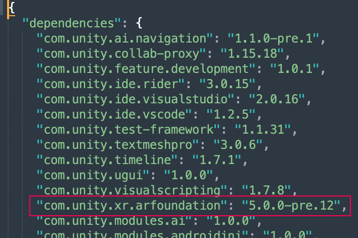

# Access AR Foundation 5.0 in Unity 2021

AR Foundation 5.0 is compatible with Unity Editor versions 2021.2 and 2021.3, but it does not appear in the Package Manager window for these Editor versions. See the following topics to learn why this is the case and how to access AR Foundation 5.0 in these Unity Editor versions.

| Topic | Description |
| :---- | :---------- |
| [Understand the Package Manager window](#understand-the-package-manager-window) | Understand why AR Foundation 5.0 does not appear in the Package Manager window in Unity 2021.2 or 2021.3 |
| [Edit your project manifest](#edit-your-project-manifest) | Learn how to access AR Foundation 5.0 in Unity 2021.2 or 2021.3. |

## Understand the Package Manager window

Since Unity 2021.1, Unity's release management team grants packages a "Released" status after they pass several testing stages and validation procedures for the Unity Editor version in development at that time. This means that the latest validated package version in your Unity Editor version might not be the latest published package. See [package states and lifecycle](https://docs.unity3d.com/Manual/upm-lifecycle.html) to learn more about the package lifecycle.

Unity fully supports "Released" packages with the LTS cycle of their corresponding Editor version. For example, AR Foundation 5.0 entered "Released" status during development of Unity 2022.2, and will be supported alongside the 2022.3 LTS version of the Unity Editor. Thus, AR Foundation 5.0 appears in the Package Manager window in Unity 2022.2.

It is possible to access AR Foundation 5.0 in Unity Editor versions 2021.2 or 2021.3, but AR Foundation 5.0 does not appear in the Package Manager window for these versions because they do not follow the same procedures for testing, validation, and LTS support.

To access AR Foundation 5.0 in Unity 2021.2 or 2021.3, edit your project manifest as explained below.

## Edit your project manifest

When Unity loads a project, the Package Manager reads the [project manifest](https://docs.unity3d.com/Manual/upm-manifestPrj.html) located under the root folder of your project at `Packages/manifest.json` so that it can compute a list of which packages to retrieve and load.

When you edit your project manifest, you control which package versions Unity loads into your project. There are two ways to edit your project manifest: add a package by name, or manually edit the project manifest file. 

### Add a package by name in the Package Manager window

As of Unity 2021.1, you can [add a registry package by name](https://docs.unity3d.com/Manual/upm-ui-quick.html) using the Package Manager window.

To access AR Foundation 5.0 in Unity 2021.2 or 2021.3 this way, follow the steps below:

1. In the Package Manger window, add `com.unity.xr.arfoundation` by name and type your desired version number into the **Version (optional)** field.

	> [!NOTE]
	> The latest version of AR Foundation is listed in the dropdown on the top left of this page above the table of contents. See [Install AR Foundation](xref:arfoundation-install) to confirm Editor compatibility requirements.

2. If your project targets Android and/or iOS devices, add `com.unity.xr.arcore` and/or `com.unity.xr.arkit`, respectively, with the same version number as AR Foundation.

3. If your project targets OpenXR devices, add `com.unity.xr.openxr`. If you do not specify a version number, Unity will import the most recent verified package for your Editor version, otherwise see the [OpenXR Plug-in documentation](https://docs.unity3d.com/Packages/com.unity.xr.openxr@latest) to learn more about compatible versions for your Editor.

4. If you are upgrading from AR Foundation 4, you should [remove](https://docs.unity3d.com/Manual/upm-ui-remove.html) `com.unity.xr.arsubsystems` and `com.unity.xr.arkit-face-tracking` if present. These packages were deprecated with the release of AR Foundation 5.0, and their contents were merged into `com.unity.xr.arfoundation` and `com.unity.xr.arkit`, respectively. Both of these packages are now empty and discontinued as of version 5.0.0.

### Manually edit the project manifest file

If you prefer to use a text editor, you can follow the steps below to manually edit your project manifest file:

1. Open `Packages/manifest.json` in a text editor.

2. Find the line containing `"com.unity.xr.arfoundation"`.

	

	If you haven't [installed AR Foundation](xref:arfoundation-install) in your project, this line will not appear in your project manifest. In this case you can manually type it in yourself.

3. Edit the AR Foundation version number to your desired version.

4. If `com.unity.xr.arcore` or `com.unity.xr.arkit` are present in your manifest, change their versions to match your chosen AR Foundation version.

5. If `com.unity.xr.arsubsystems` or `com.unity.xr.arkit-face-tracking` are present in your manifest, you should delete these lines.

6. You can optionally add or edit the manifest entry for `com.unity.xr.openxr` to select your preferred version of the OpenXR Plug-in. See the [OpenXR Plug-in documentation](https://docs.unity3d.com/Packages/com.unity.xr.openxr@latest) to learn more about compatible versions for your Editor.

7. If the Editor is open, Unity will import your chosen version of AR Foundation when the Editor regains focus. Otherwise, Unity imports packages when it loads a project.
