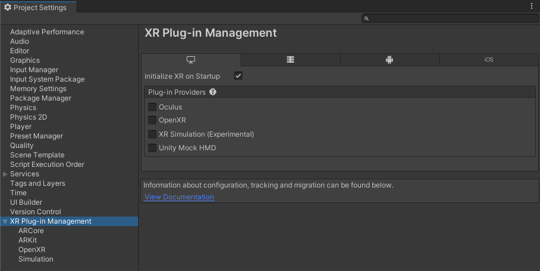

# Install AR Foundation

AR Foundation is an official Unity package available via the [Package Manager](https://learn.unity.com/tutorial/the-package-manager).

## Editor compatibility

AR Foundation 5.0 is compatible with Unity 2021.2 and up.

> [!NOTE]
> AR Foundation 5.0 is compatible with Unity 2021.2 and 2021.3, but it does not appear in the Package Manager window of these Editor versions. See [access AR Foundation 5.0 in Unity 2021](xref:arfoundation-edit-your-project-manifest) to learn how to edit your project manifest.

### Older Editor versions

If your project requires an older version of the Editor, you can use the following supported versions of AR Foundation:

| Editor version | AR Foundation version |
| :------------: | :-------------------: |
|     2020.3+    |          4.2          |
|     2019.4+    |          4.1          |

# Required packages

The AR Foundation package contains interfaces for AR features, but doesn't implement any AR features itself. To use AR Foundation on a target platform, you also need a separate *provider plug-in* package for that platform. A provider plug-in is a separate package containing AR Foundation feature implementations for a given platform.

Unity officially supports the following provider plug-ins with this version of AR Foundation:

| AR Platform | Provider plug-in                                                                                        | Version |
| :---------- | :------------------------------------------------------------------------------------------------------ | :------ |
| Android     | [Google ARCore XR Plug-in](https://docs.unity3d.com/Packages/com.unity.xr.arcore@5.0/manual/index.html) |   5.0   |
| iOS         | [Apple ARKit XR Plug-in](https://docs.unity3d.com/Packages/com.unity.xr.arkit@5.0/manual/index.html)    |   5.0   |
| HoloLens 2  | [OpenXR Plug-in](https://docs.unity3d.com/Packages/com.unity.xr.openxr@1.5/manual/index.html)           |   1.5   |

To use AR Foundation on a device, you must install at least one provider plug-in, either from the Package Manager or by going to **Project Settings** > **XR Plug-in Management** as shown below.

 *XR Plug-in Management*

> [!NOTE]
> To use additional ARCore functionality such as Cloud Anchors, install Google's [ARCore Extensions for AR Foundation](https://developers.google.com/ar/develop/unity-arf).

## Provider project settings

Some provider plug-ins require that you set specific project settings for AR to function properly. See their documentation for specific instructions:

| Provider plug-in | Setup instructions |
| :--------------- | :----------------- |
| [Google ARCore XR Plug-in](https://docs.unity3d.com/Packages/com.unity.xr.arcore@5.0/manual/index.html) | [Project configuration](https://docs.unity3d.com/Packages/com.unity.xr.arcore@5.0/manual/project-configuration-arcore.html) |
| [Apple ARKit XR Plug-in](https://docs.unity3d.com/Packages/com.unity.xr.arkit@5.0/manual/index.html) | [Project configuration](https://docs.unity3d.com/Packages/com.unity.xr.arkit@5.0/manual/project-configuration-arkit.html) |

## Third-party plug-ins

It is possible to develop custom provider plug-ins for AR Foundation. If you are using a third-party provider plug-in, see your plug-in documentation for more specific instructions regarding installation and use.

[!include]
