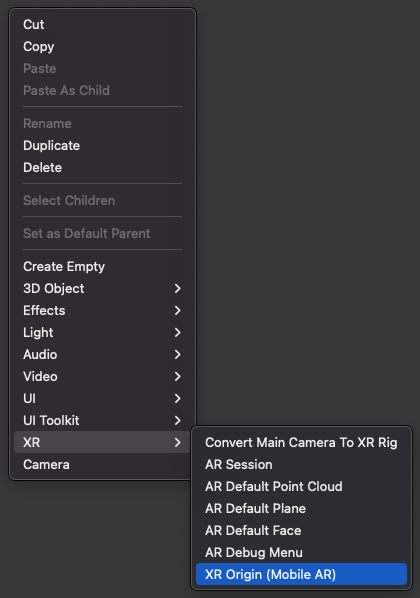
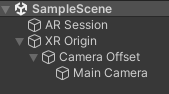

# Scene setup

There are two necessary GameObjects to have in each AR scene in your app: an **AR Session** and an **XR Origin**.

The AR Session GameObject enables AR on the target platform, and the XR Origin GameObject enables device tracking and transforms trackables into Unity's coordinate system. If either of these GameObjects is not present in the scene, AR will not function properly.

To create an AR Session or an XR Origin, right-click in the Hierarchy window, and select one of the following options from the context menu.
* **XR** &gt; **AR Session**
* **XR** &gt; **XR Origin (Mobile AR)**

 *Create AR Session and XR Origin*

After adding both an AR Session and XR Origin to the scene, the Hierarchy window will look like the one below, with GameObjects named "AR Session" and "XR Origin". XR Origin has a child GameObject named "Camera Offset", and Camera Offset has a child GameObject named "Main Camera".

 *Scene graph containing AR Session and XR Origin*

This is the default scene setup, but you can rename or reparent the GameObjects according to your project needs.

The AR Session and XR Origin GameObjects and their components play an important role in an AR Foundation project. To understand them in greater detail, see [Session](xref:arfoundation-session) and [Device tracking](xref:arfoundation-device-tracking), respectively.
