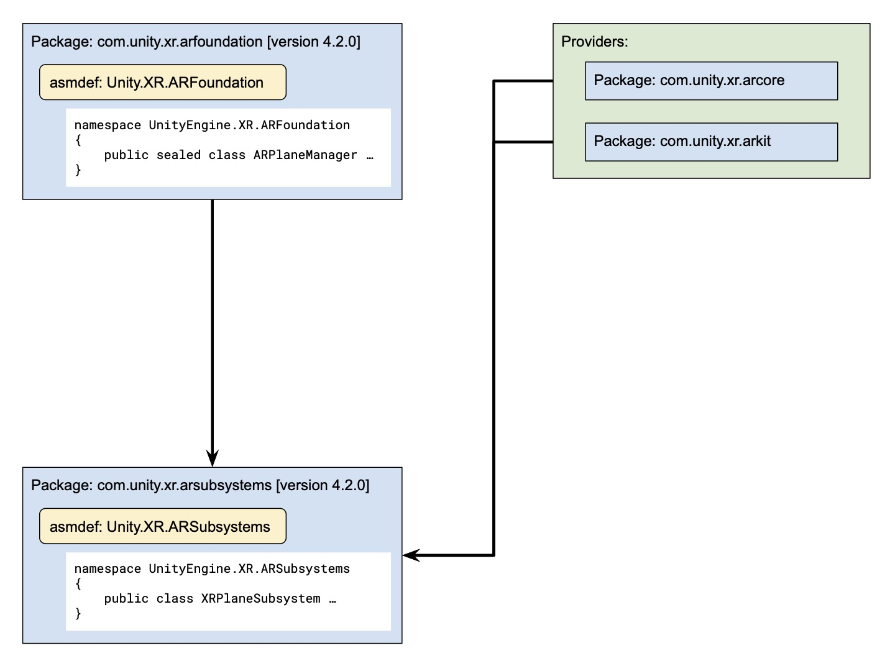
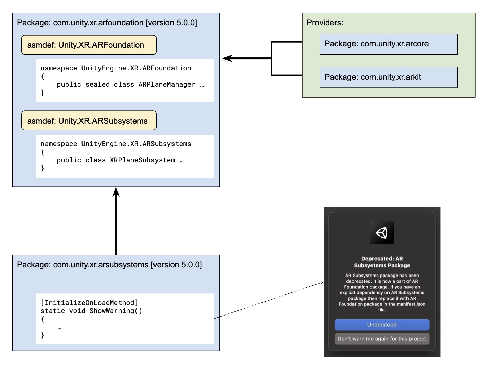

<!-- To do in follow-up PR: move this information to Migration-guide-5.x page, and reformat this page as a landing page for all the migration guides -->

# Upgrading to AR Foundation version 5.0

To upgrade to AR Foundation package version 5.0, you need to do the following:

- Use Unity 2021.2 or newer.
- Be aware of the change in package structure.
- Upgrade from AR Session Origin to XR Origin.

**Use Unity 2021.2 or newer**

This version of the package requires Unity 2021.2 or newer.

**Be aware of the change in package structures**

The `com.unity.xr.arsubsystems` package has been merged into ARFoundation. In most cases, no action is required but if an explicit dependency on ARSubsystems Package is listed in the project then it should be replaced with `com.unity.xr.arfoundation`.

- Package Structure in `v4.2`

- New package Structure in `v5.0`

**Upgrade from AR Session Origin to XR Origin**

As of 5.0, `ARSessionOrigin` is deprecated and will be replaced with `XROrigin`. Make sure to replace all references to `ARSessionOrigin` in your project with `XROrigin`.

The `XROrigin` represents the center of worldspace in both AR and VR, and thus can be used across all XR scenes as opposed to `ARSessionOrigin` which was AR specific. For more about XR Origin, see the [XR Core Utilities Package documentation](https://docs.unity3d.com/Packages/com.unity.xr.core-utils@latest/index.html), and for steps on how to migrate see the [5.0 migration guide](migration-guide-5-x.md).
