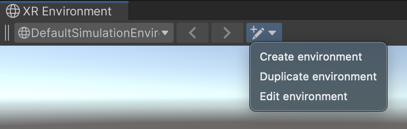
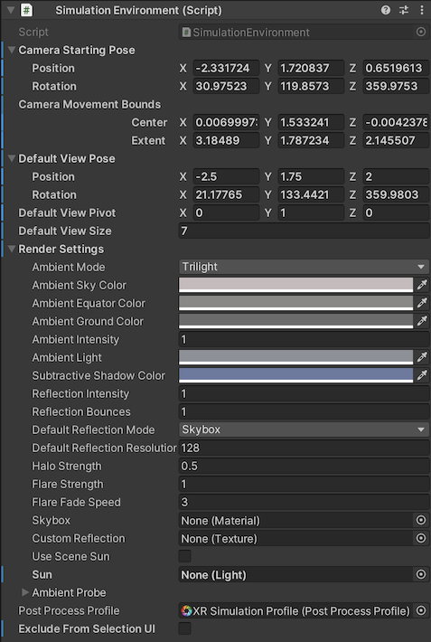
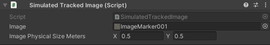
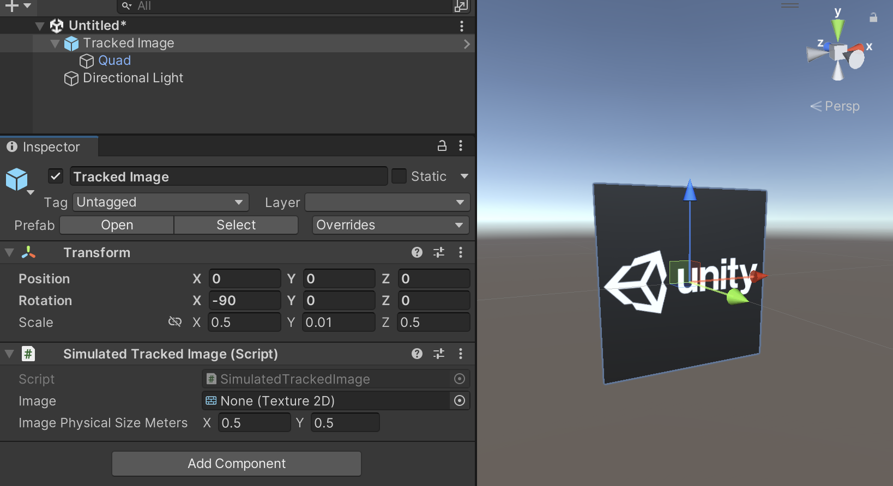
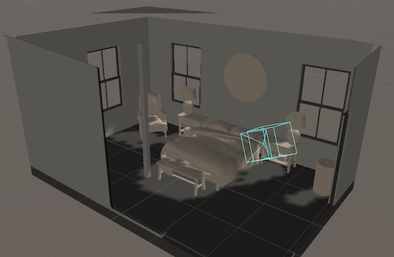
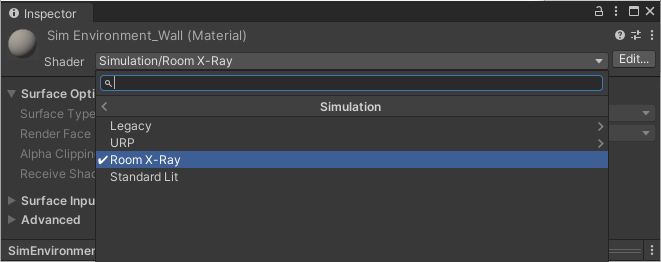
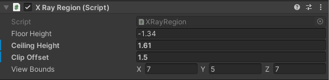

# XR Simulation environments

XR Simulation environments are Prefabs that contain the geomtery of the environment as well as preconfigured components that control the simulation behavior. AR Foundation detects [trackables](xref:arfoundation-managers#trackables-and-trackable-managers) in XR Simulation environments such as planes, images, and point clouds as if the environment were a physical space.

## Create and edit XR Simulation environments

You can create, duplicate, or edit an XR Simulation environment Prefab using the [XR Environment view](xref:arfoundation-simulation-xr-environment-view).

 *Create/edit environment dropdown in the XR Environment view*

### Create or edit an environment Prefab

1. Go to **Window** > **XR** > **AR Foundation** > **XR Environment** to open the XR Environment view.
2. Optionally select an environment from the Environment dropdown if you wish to duplicate or edit that environment.
3. Click the Create/edit environment dropdown on the far right of the XR Environment overlay.
4. Click one of the following options:
   - **Create environment**: Create and save a new environment using the default XR Simulation environment as a template.
   - **Duplicate environment**: Create and save a copy of the active environment.
   - **Edit environment**: Open the active environment for editing in [Prefab Mode](https://docs.unity3d.com/Manual/EditingInPrefabMode.html).

### Convert an existing Prefab into an environment

1. Open any Prefab for editing in [Prefab Mode](https://docs.unity3d.com/Manual/EditingInPrefabMode.html).
2. Add a [Simulation Environment component](#simulation-environment-component) to the root GameObject of the Prefab. XR Simulation requires that the Prefab only have one root GameObject.
3. You can optionally add additional XR Simulation components, such as a [Simulated Tracked Image component](#simulated-tracked-image-component), as needed to test your app's features.
4. Save the Prefab.
5. Refresh the Environment list in the XR Environment view by going to **Assets** > **Refresh XR Environment List**.

> [!TIP]
> Since XR Simulation environments are Prefabs, you can use any of the standard tools in the Unity Editor to create and edit them. The only requirement for a Prefab to be considered an XR Simulation environment is for its root GameObject to have a [Simulation Environment component](#simulation-environment-component) attached.

# Components and shaders

AR Foundation contains the following components and shaders you can use to create XR Simulation environments:

<table>
  <tr>
   <td colspan="2" ><strong>Component or shader</strong></td>
   <td><strong>Description</strong></td>
  </tr>
  <tr>
   <td colspan="2" ><a href="#simulation-environment-component">Simulation Environment component</a></td>
   <td>Add to the root GameObject of a Prefab to designate it as an XR Simulation environment. XR Simulation automatically finds environment Prefabs and adds them to the Environment list in the <a href="simulation-xr-environment-view.md">XR Environment view</a>.</td>
  </tr>
  <tr>
   <td colspan="2" ><a href="#simulated-tracked-image-component">Simulated Tracked Image component</a></td>
   <td>Add to a GameObject in an XR Simulation environment to designate it as a simulated tracked image for image tracking purposes.</td>
  </tr>
  <tr>
   <td colspan="2" ><a href="#x-ray-rendering">X-ray rendering</a></td>
   <td>Add the X Ray Region component and x-ray shaders to an XR Simulation environment to make it easier to prevent the camera from being obstructed by exterior walls.</td>
  </tr>
  <tr>
   <td></td>
   <td><a href="#x-ray-region-component">X Ray Region component</a></td>
   <td>Defines the active area for any x-ray shaders in the scene.</td>
  </tr>
  <tr>
   <td></td>
   <td><a href="#x-ray-shaders">X-ray shaders</a></td>
   <td>Shaders that clip exterior surfaces, allowing the Camera to easily see into interior rooms from outside the walls.</td>
  </tr>
</table>

<!-- uncomment and add to table above when documentation is added | [Simulated Bounded Plane component](#simulated-bounded-plane-component) || | -->

<!-- uncomment and add to table above when documentation is added | [Simulated Mesh Classification component](#simulated-mesh-classification-component) || | -->

## Simulation Environment component

Add a Simulation Environment component to the root GameObject of a Prefab to designate it as an XR Simulation environment. You can view and edit its properties in the Inspector window as shown below:

 *Simulation Environment component*

| Property | Description |
| :------- | :---------- |
| **Camera Starting Pose** | The position and rotation to spawn the camera in the environment when you enter Play Mode. This pose is illustrated in the XR Environment view with a blue camera line drawing. |
| **Camera Movement Bounds** | The navigable area within the environment.| 
| **Default View Pose** | The default scene camera position and orientation when previewing the environment in the XR Environment view.
| **Default View Pivot** | The default pivot location of the scene camera when previewing the environment in the XR Environment view. |
| **Default View Size** | The default scene camera orbit radius when previewing the environment in the XR Environment view. |
| **Render Settings** | The [RenderSettings](xref:UnityEngine.RenderSettings) object for rendering the environment. |
| **Exclude from Selection UI** | Hides the environment from the Environment dropdown menu in the [XR Environment view](xref:arfoundation-simulation-xr-environment-view).  |

> [!TIP]
> If you have a base Prefab in your project that serves as the basis for other environments, but should not be used itself, set **Exclude from Selection UI** to `true`. When this option is enabled, the Prefab is hidden from the Environment dropdown in the XR Environment view.

## Simulated Tracked Image component

Add a Simulated Tracked Image component to a GameObject in your XR Simulation environment to designate it as a *simulated tracked image*. Simulated tracked images simulate AR Foundation's [image tracking](xref:arfoundation-image-tracking) feature, and you can [respond to detected images](xref:arfoundation-image-tracking#respond-to-detected-images) in XR Simulation environments the same way that you would on device.

 *Simulated Tracked Image component*

XR Simulation can detect and track all simulated tracked images in an environment, even if you have not included their textures in your [reference image library](xref:arfoundation-image-tracking#reference-image-library). To optionally bind a simulated tracked image to your reference image library, set the **Image** field of its Simulated Tracked Image component to reference a texture asset that is also used in the reference image library.

When XR Simulation detects images that are not part of the reference image library, the corresponding [ARTrackedImage](xref:UnityEngine.XR.ARFoundation.ARTrackedImage) trackables will not contain a fully initialized [referenceImage](xref:UnityEngine.XR.ARFoundation.ARTrackedImage.referenceImage). Instead, the `guid` property of the [referenceImage](xref:UnityEngine.XR.ARFoundation.ARTrackedImage.referenceImage) is set to zero, and its `texture` is set to `null`.

| Property | Description |
| :------- | :---------- |
| **Image** | A reference to the [Texture2D](xref:UnityEngine.Texture2D) asset of the image. Optionally, this can also match a texture asset in your [reference image library](xref:arfoundation-image-tracking#reference-image-library). |
| **Image Physical Size Meters** | The size in meters of the image in the environment. This influences the distance at which an image can be detected by the simulated device. Set this value to the expected size of the image in the real world. |

### Simulated Tracked Image setup

For XR Simulation to track images properly, a simulated tracked image's transform must be orientated such that its local y-axis (the green arrow) points in the same direction as the image surface normal: perpendicular to the image plane with its positive direction pointing forward from the image. Likewise, a tracked image's z-axis (the blue arrow) must point upward to the top of the image. See the example simulated tracked image below as a reference:

 *An example simulated tracked image with green arrow pointing forward and blue arrow pointing up*

To visualize a simulated tracked image in your environment, Unity recommends creating a Quad as a child GameObject of the simulated tracked image. Rotate the Quad 90 degrees along its x-axis, and set its scale to match the Simulated Tracked Image component's **Image Physical Size Meters** property. You can see this GameObject hiearchy used in the example simulated tracked image above.

> [!NOTE]
> Visually representing a simulated tracked image in an XR Simulation environment is optional. XR Simulation only uses the Simulated Tracked Image component to detect and track images. It does not use textured meshes rendered in the environment for this purpose.

<!-- Uncomment when component is fully implemented...

### Simulated Mesh Classification component

XR Simulation environments can provide a snapshot of mesh data, which is generated by combining meshes from all [Mesh Filters](https://docs.unity3d.com/Manual/class-MeshFilter.html) in the environment. Normally, XR Simulation reports mesh data without classification information. Add a Simulated Mesh Classification component to define a mesh classification type for a GameObject and its child GameObjects.  

 *Simulated Mesh Classification component*

The Simulated Mesh Classification component has a single property, **Classification Type**. Set this property to a string, such as "table", "wall", "seat", or "floor". In Play Mode, the XR Simulation [meshing](xref:arfoundation-mesh-manager) feature uses this value to classify all meshes referenced by Mesh Filter components on this GameObject and its child GameObjects.
-->

<!-- Uncomment when documentation is available...

### Simulated Bounded Plane component
-->

## X-ray rendering

XR Simulation provides specialized x-ray shaders that allow the camera to see through exterior walls as you navigate around the environment. This x-ray perspective can make it easier to test your app by preventing your camera view from being obstructed as you move around.

 *Bedroom environment with x-ray shader*

To enable x-ray rendering, use the `Simulation/Room X-Ray` shader on your exterior walls, ceiling and floor. You must also add an [X Ray Region component](#x-ray-region-component) component to a GameObject in your environment.

### X-ray shaders

Add the `Simulation/Room X-Ray` shader to the walls and ceilings of enclosed environments, such as rooms, to clip exterior walls in the AR Environment view. Find the **Room X-Ray** shader under **Simulation** in the Shader menu of a Material asset. 

 *Simulation shader menu*

> [!NOTE]
> You do not need to select the Legacy or URP versions of the shader directly. The `Simulation/Room X-Ray` shader falls back to the URP or legacy built-in versions as needed.

The XR Simulation sample environments include Materials that use the X-ray shaders. If you have [installed the sample environments](xref:arfoundation-simulation-getting-started#install-the-sample-environments), you can use these Materials, which are located in the Assets folder under `UnityXRContent/ARFoundation/SimulationEnvironments/Common/Materials`.

### X Ray Region component

The X Ray Region component defines information used by the X-ray shaders.

 *X Ray Region component*

| Property           | Description |
| :----------------- | :---------- |
| **Floor Height**   | The floor in local coordinates. |
| **Ceiling Height** | The ceiling in local coordinates. |
| **Clip Offset**    | How much the camera clipping plane moves forward from the center of this region. |
| **View Bounds**    | The size of the x-ray clipping region. |

> [!TIP]
> In the sample environments, the GameObjects with **X-Ray Region** components attached are named "ClippingRegion". 
