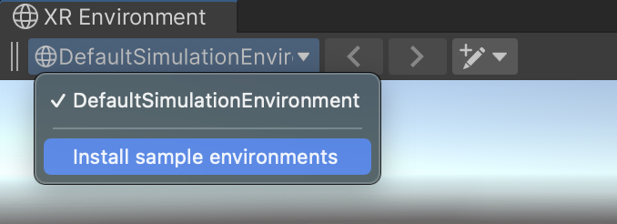

# Getting started

You can test your AR scenes using XR Simulation with no scene changes necessary.

To run your app in a simulated environment:

1. Enable XR Simulation:

   1. Go to **Edit** > **Project Settings** to open the **Project Settings** window.
   2. In the **Project Settings** window, select **XR Plug-in Management**.
   3. Under **Plug-in Providers**, enable **XR Simulation**.

2. Select an XR Simulation environment:
   
   1. Go to **Window** > **XR** > **AR Foundation** > **XR Environment** to open the [XR Environment view](xref:arfoundation-simulation-xr-environment-view).
   2. Select a simulation environment using the Environment dropdown in the center of the XR Environment overlay. At first your project only contains one environment, but you can [Install the sample environments](#install-the-sample-environments) to add more.

      

3. Open an AR scene, then press the **Play** button to enter Play Mode and begin simulation.

> [!NOTE]
> As with all AR scenes, your scene must contain both an AR Session and an XR Origin for AR to function properly. See [Scene setup](xref:arfoundation-scene-setup) for more information.

## Install the sample environments

AR Foundation includes a variety of sample XR Simulation environments that you can optionally install to test your app. The XR Simulation sample environments include various scenes including interior rooms in homes and workplaces as well as exterior city and park settings.

To install the XR Simulation sample environments into your project:

1. Go to **Window** > **XR** > **AR Foundation** > **XR Environment** to open the [XR Environment view](xref:arfoundation-simulation-xr-environment-view).
2. Click on the Environment dropdown to display the list of environments in your project. A new project will only contain one environment, named "DefaultSimulationEnvironment".

   

3. At the bottom of the list, click **Install sample environments**.

   The sample environments are provided in a standard Unity [Asset package](https://docs.unity3d.com/Manual/AssetPackages.html). When you click **Install sample environments**, Unity automatically downloads the package and opens the **Import Unity Package** window.

4. Select the environment Assets that you want to add to your project.
5. Click **Import**.

AR Foundation installs the environments to your Assets folder under `UnityXRContent/ARFoundation`.

> [!NOTE]
> If you have already installed the sample environments, you can re-import them following the same process as above. In this case, the environment list provides an **Import simulation environments** option rather than **Install simulation environments**.

## Navigation controls

You can navigate around the XR Simulation environment in the Game view during Play Mode using the same controls as you would in the Scene view's [Flythrough mode](https://docs.unity3d.com/2019.1/Documentation/Manual/SceneViewNavigation.html):

* Click and hold the right mouse button.
* Move the view around using the mouse, the **WASD** keys to move left/right/forward/backward, and the **Q** and **E** keys to move up and down.
* Hold down **Shift** to move faster.
