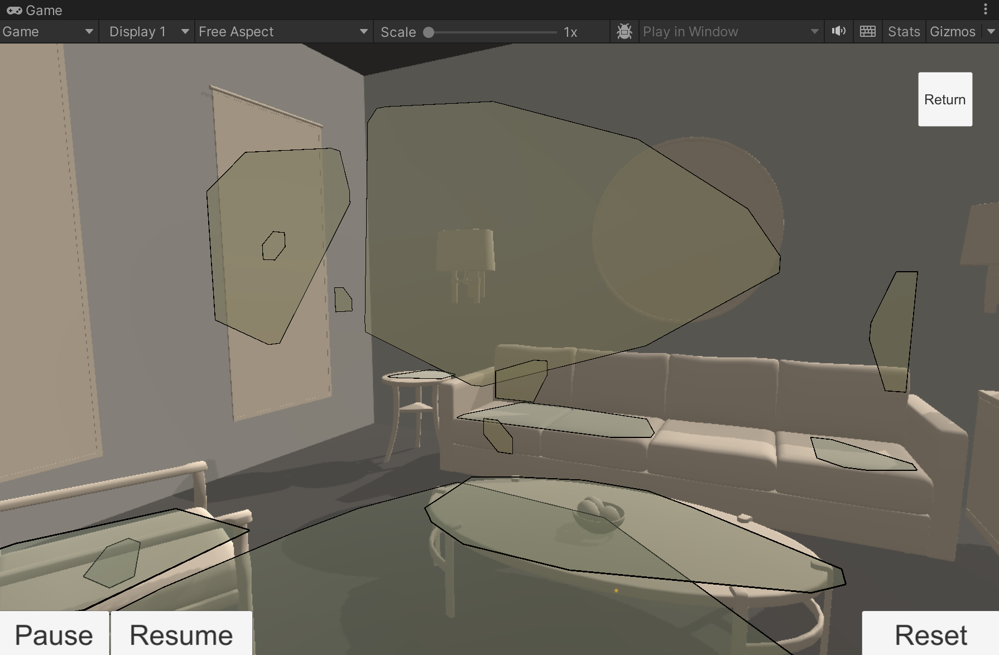

# Overview

XR Simulation lets you test your AR app in the Editor, simulating the behavior of an XR device as it moves through specially configured scenes called *XR Simulation environments*. With XR Simulation enabled, you can quickly test your AR app in a variety of environments without needing to build to a device or physically move to a different location.

 *XR Simulation runs the [Simple AR sample](https://github.com/Unity-Technologies/arfoundation-samples#simplear), demonstrating plane detection in a living room environment*

When you enter Play Mode with XR Simulation enabled, AR Foundation loads your XR Simulation environment into the scene with keyboard and mouse navigation controls. As you navigate the environment, AR Foundation detects [trackables](xref:arfoundation-managers#trackables-and-trackable-managers) such as planes, images, and point clouds as if you were moving around in a real space.

AR Foundation includes a variety of preconfigured sample environments that you can optionally install and use, and you can also create your own environments.

You can currently test the following AR features using XR Simulation:

| Feature                                                                                       |   |
| :-------------------------------------------------------------------------------------------- |:-:|
| [Session](xref:arfoundation-session)                                                          | Yes |
| [Device tracking](xref:arfoundation-device-tracking)                                          | Yes |
| [Camera](xref:arfoundation-camera)                                                            | Yes |
| [Plane detection](xref:arfoundation-plane-detection)                                          | Yes |
| [Image tracking](xref:arfoundation-image-tracking)                                            | Yes |
| [Object tracking](xref:arfoundation-object-tracking)                                          |   |
| [Face tracking](xref:arfoundation-face-tracking)                                              |   |
| [Body tracking](xref:UnityEngine.XR.ARFoundation.ARHumanBodyManager)                          |   |
| [Point clouds](xref:arfoundation-point-clouds)                                                | Yes |
| [Raycasts](xref:arfoundation-raycasts)                                                        | Yes |
| [Anchors](xref:arfoundation-anchors)                                                          |   |
| [Meshing](xref:arfoundation-meshing)                                                          | Yes |
| [Environment Probes](xref:arfoundation-environment-probes)                                    |   |
| [Occlusion](xref:arfoundation-occlusion)                                                      |   |
| [Participants](xref:arfoundation-participant-tracking)                                        |   |

## Architecture

AR Foundation defines its AR features using [subsystems](xref:arfoundation-subsystems). Subsystem implementations are called *providers*. XR Simulation includes Editor-only providers for certain subsystems as shown above, allowing you test your app in Play Mode with no changes necessary to your scene or build settings.

> [!NOTE]
> AR Foundation only uses the XR Simulation providers when you run your app in the Editor. The appropriate platform provider, such as the [Google ARCore XR Plug-in](https://docs.unity3d.com/Packages/com.unity.xr.arcore@5.0/manual/index.html) on Android and the [Apple ARKit XR Plug-in](https://docs.unity3d.com/Packages/com.unity.xr.arkit@5.0/manual/index.html) on iOS, is always used when you build and run on a device.

## Limitations

XR Simulation has limitations you should consider when testing your app. Most importantly, while XR Simulation is designed to approximate the behavior of an XR device in various environments, simulations cannot exactly replicate device behavior and should not be considered a replacement for on-device testing. Unity recommends that you fully test your app on devices you intend to support, while XR Simulation allows you to more quickly iterate on some features without requiring a new build for each iteration.

The following AR features also have limitations in XR Simulation:

* **Plane Detection:** Planes are only detectable on axis-aligned surfaces.
* **Meshing:** Meshes are all detected immediately on entering Play Mode.
