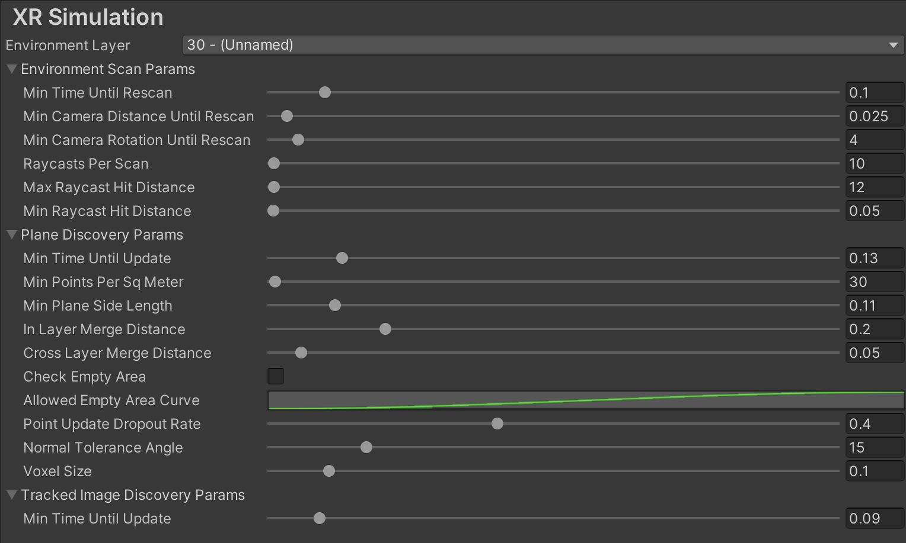
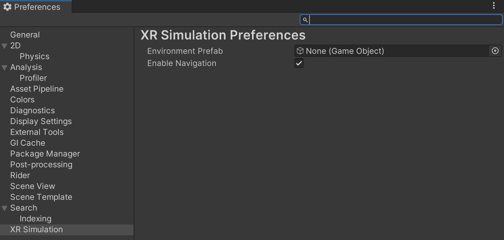

# XR Simulation project settings

Go to **Edit** > **Project Settings** > **XR Plug-in Management** > **XR Simulation** to tune the performance of XR Simulation according to your project's needs. XR Simulation project settings are saved under your Assets folder at `XR/Resources/XRSimulationRuntimeSettings.asset`.

 *XR Simulation project settings*

<table>
  <tr>
   <td colspan="2" ><strong>Setting</strong></td>
   <td><strong>Description</strong></td>
  </tr>
  <tr>
   <td colspan="2" ><strong>Environment Layer</strong></td>
   <td>XR Simulation requires a dedicated <a href="https://docs.unity3d.com/Manual/Layers.html">layer</a> to render the XR Simulation environment separately from your scene. That layer is specified here, and by default is layer 30.</td>
  </tr>
  <tr>
   <td colspan="2" ><strong>Environment Scan Params</strong></td>
   <td>XR Simulation scans for point clouds and planes in the environment by raycasting against its meshes. These settings control that process.</td>
  </tr>
  <tr>
   <td></td>
   <td><strong>Min Time Until Rescan</strong></td>
   <td>Minimum time in seconds that must elapse between environment scans.</td>
  </tr>
  <tr>
   <td></td>
   <td><strong>Min Camera Distance Until Rescan</strong></td>
   <td>Minimum distance in meters the camera must move before the next environment scan. The next environment scan will trigger on the first Update after <strong>Min Time Until Rescan</strong> has elapsed where the camera has either moved at least <strong>Min Camera Distance</strong> or rotated at least <strong>Min Camera Rotation</strong>.</td>
  </tr>
  <tr>
   <td></td>
   <td><strong>Min Camera Rotation Until Rescan</strong></td>
   <td>Minimum angle change in degrees the camera must rotate before the next environment scan. The next environment scan will trigger on the first Update after <strong>Min Time Until Rescan</strong> has elapsed where the camera has either moved at least <strong>Min Camera Distance</strong> or rotated at least <strong>Min Camera Rotation</strong>.</td>
  </tr>
  <tr>
   <td></td>
   <td><strong>Raycasts Per Scan</strong></td>
   <td>Total number of rays to cast in each environment scan. Higher values may impact system performance.</td>
  </tr>
  <tr>
   <td></td>
   <td><strong>Max Raycast Hit Distance</strong></td>
   <td>Distance in meters from the camera beyond which feature points will not be detected.</td>
  </tr>
  <tr>
   <td></td>
   <td><strong>Min Raycast Hit Distance</strong></td>
   <td>Distance in meters from the camera within which feature points will not be detected.</td>
  </tr>
  <tr>
   <td colspan="2" ><strong>Plane Discovery Params</strong></td>
   <td>Performance tuning options for plane detection.</td>
  </tr>
  <tr>
   <td></td>
   <td><strong>Min Time Until Update</strong></td>
   <td>Minimum time in seconds that must elapse between plane discovery updates.</td>
  </tr>
  <tr>
   <td></td>
   <td><strong>Min Points Per Sq Meter</strong></td>
   <td>Voxel point density, independent of voxel size.</td>
  </tr>
  <tr>
   <td></td>
   <td><strong>Min Plane Side Length</strong></td>
   <td>A plane with x or y size less than this value in meters will be ignored.</td>
  </tr>
  <tr>
   <td></td>
   <td><strong>In Layer Merge Distance</strong></td>
   <td>Planes within the same layer that are at most this distance in meters from each other will be merged.</td>
  </tr>
  <tr>
   <td></td>
   <td><strong>Cross Layer Merge Distance</strong></td>
   <td>Planes in adjacent layers with an elevation difference of at most this distance in meters will be merged.</td>
  </tr>
  <tr>
   <td></td>
   <td><strong>Check Empty Area</strong></td>
   <td>When enabled, planes will only be created if they do not contain too much empty area.</td>
  </tr>
  <tr>
   <td></td>
   <td><strong>Allowed Empty Area Curve</strong></td>
   <td>Curve that maps the area of a plane to the ratio of area that is allowed to be empty.</td>
  </tr>
  <tr>
   <td></td>
   <td><strong>Point Update Dropout Rate</strong></td>
   <td>Probability of dropping per-plane updates. If a random number between 0 and 1 is below this number, the update is dropped.</td>
  </tr>
  <tr>
   <td></td>
   <td><strong>Normal Tolerance Angle</strong></td>
   <td>If the angle between a point's normal and a voxel grid direction is within this range, the point is added to the grid.</td>
  </tr>
  <tr>
   <td></td>
   <td><strong>Voxel Size</strong></td>
   <td>Side length of each voxel in the plane voxel grid.</td>
  </tr>
  <tr>
   <td colspan="2" ><strong>Tracked Image Discovery Params</strong></td>
   <td>Performance tuning options for image tracking.</td>
  </tr>
  <tr>
   <td></td>
   <td><strong>Min Time Until Update</strong></td>
   <td>Minimum time in seconds that must elapse between image tracking updates.</td>
  </tr>
</table>

# XR Simulation preferences

Go to menu **Edit** > **Preferences** > **XR Simulation** (Windows) or **Unity** > **Preferences** > **XR Simulation** (Mac) to set your preferences for XR Simulation. Preferences are saved under your Assets folder at `XR/UserSimulationSettings/Resources/XRSimulationPreferences.asset`.

 *XR Simulation preferences*

| Setting | Description |
| :------ | :---------- |
| **Environment Prefab** | Stores the Prefab asset for the active XR Simulation environment. Note that it is easier to set this in the [XR Environment view](xref:arfoundation-simulation-xr-environment-view) because the view's Environment list only includes environment Prefabs rather than every Prefab in the project. |
| **Enable Navigation** | Enables or disables the navigation controls that XR simulation adds to the Game view (using the **WASD**, **Q**, **E**, and **Shift** keys and the mouse). You can disable these navigation controls if they interfere with your own input handling. |
