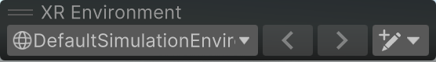
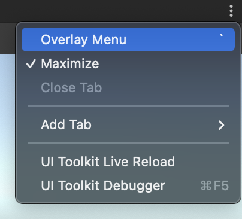
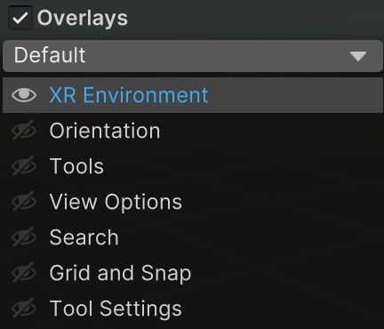

# XR Environment view

Go to **Window** > **XR** > **AR Foundation** > **XR Environment** to open the XR Environment view. The XR Environment view lets you create and edit XR Simulation environments, as well as select and preview the currently active environment. When you enter Play Mode, XR Simulation runs your app in the active environment as if that environment were a physical space.

 *The XR Environment view*

<table>
  <tr>
   <td><strong>Label</strong></td>
   <td colspan="2" ><strong>Element</strong></td>
   <td><strong>Description</strong></td>
  </tr>
   <td><strong>A</strong></td>
   <td colspan="2" ><strong>Environment dropdown:</strong></td>
   <td>Displays the currently selected simulation environment. Click to reveal the controls listed below for selecting different environments.</td>
  </tr>
  <tr>
   <td></td>
   <td></td>
   <td><strong>Environment list</strong></td>
   <td>Lists all environment Prefabs found in the Assets folder. Click on an environment to select it, making it the active environment. Refresh the list by going to <strong>Assets</strong> &gt; <strong>Refresh XR Environment List</strong>.</td>
  </tr>
  <tr>
   <td></td>
   <td></td>
   <td><strong>Install sample environments</strong></td>
   <td>Installs the sample environment assets to your project. See <a href="simulation-getting-started.md#install-the-sample-environments">Install the sample environments</a>.</td>
  </tr>
  <tr>
   <td><strong>B</strong></td>
   <td colspan="2" ><strong>Previous environment</strong></td>
   <td>Select the previous environment in the Environments list.</td>
  </tr>
  <tr>
   <td><strong>C</strong></td>
   <td colspan="2" ><strong>Next environment</strong></td>
   <td>Select the next environment in the Environments list.</td>
  </tr>
   <td><strong>D</strong></td>
   <td colspan="2" ><strong>Create/edit environment dropdown:</strong></td>
   <td>Click to reveal the controls listed below for creating and editing environments.</td>
  </tr>
  <tr>
   <td></td>
   <td></td>
   <td><strong>Create environment</strong></td>
   <td>Create and save a new environment using the default XR Simulation environment as a template.</td>
  </tr>
  <tr>
   <td></td>
   <td></td>
   <td><strong>Duplicate environment</strong></td>
   <td>Create and save a copy of the active environment.</td>
  </tr>
  <tr>
   <td></td>
   <td></td>
   <td><strong>Edit environment</strong></td>
   <td>Open the active environment for editing in <a href="https://docs.unity3d.com/Manual/EditingInPrefabMode.html">Prefab Mode</a>.</td>
  </tr>
  <tr>
   <td><strong>E</strong></td>
   <td colspan="2" ><strong>Camera starting pose</strong></td>
   <td>Visualizes the initial position and rotation of the Camera in the environment when you enter Play Mode. See <a href="simulation-environments.md#simulation-environment-component">Simulation Environment component</a> for more information about setting these values.</td>
  </tr>
</table>

Any Prefab under your Assets folder with a `SimulationEnvironment` component on the root GameObject is considered to be a simulation environment and can appear in the Environment list. This list is cached and can be refreshed by going to **Assets** > **Refresh XR Environment List**. See [Install the sample environments](xref:arfoundation-simulation-getting-started#install-the-sample-environments) to install the sample environments, or [Simulation environments](xref:arfoundation-simulation-environments) to create and modify environments.

## XR Environment overlay

The XR Environment overlay is a toolbar [overlay](https://docs.unity3d.com/Manual/overlays.html) that controls the behavior of the XR Environment view.

 *XR Environment overlay*

When you first open the XR Environment view, the XR Environment overlay and several other overlays are displayed by default, but you can customize which overlays you wish to display or hide. Only the XR Environment overlay is required to use the XR Environment view, and you can display or hide any additional overlays according to your preferences. You can also position and dock an overlay by clicking and dragging its handle (**=**).

To display or hide an overlay, follow the steps below:

1. Click the **⋮** icon in the top right corner of the XR Environment view.
2. Click **Overlay Menu** to open the Overlay menu.

   

3. Toggle the visibility of overlays using the controls in the Overlay menu.

   
