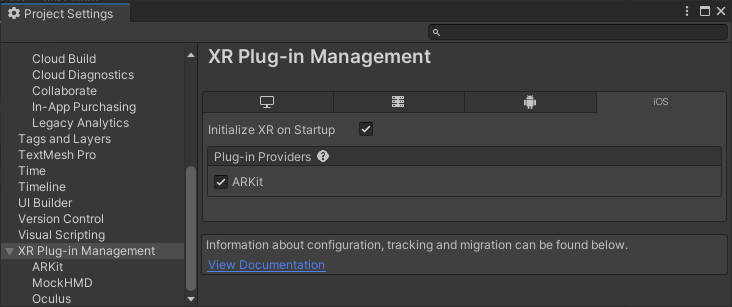
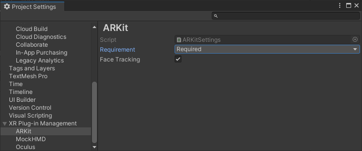
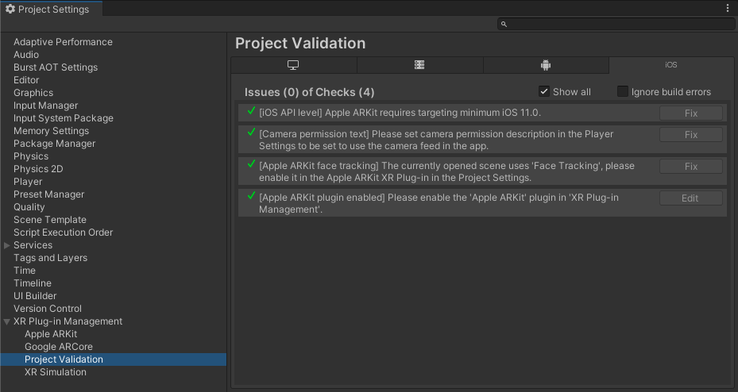

# Project configuration

Use the **XR Plug-in Management** settings to configure the Apple ARKit plug-in for your project. 

To get started, follow the instructions in [Enable the ARKit plug-in](#enable-arkit). This also installs the ARKit package, if needed. Once installed and enabled, you can configure your project settings as described in the [ARKit Project settings](#project-settings) section.

You can review the [Project validation](#project-validation) section of the **XR Plug-in Management** settings to discover if any setting values are incompatible with ARKit.

## ARKit Project settings

Some ARKit features require specific Unity Project settings to function properly. The settings include:

* **[Apple ARKit plug-in enabled](#enable-arkit)**: must be enabled to use ARKit features.
* **[Target minimum iOS Version](#minimum-ios-version)**: must be set to 11 or higher.
* **[Camera Usage Description](#camera-usage)**: must be filled in to use AR.
* **[Face tracking subsystem enabled](#enable-face-tracking)**: must be enabled to use Face tracking features.
* **[ARKit support Requirement](#arkit-required)**: can be set to **optional** or **required** depending on whether your app can be used without ARKit support.

### Enable the Apple ARKit plug-in

To use ARKit, you must enable the plug-in in your **XR Plug-in Management** settings. (Installing the package from the Package Manager does not automatically enable the plug-in.)

> [!NOTE]
> Enabling ARKit also installs the package, if necessary. However, disabling ARkit does not uninstall the package.

You must install the **iOS Module** using the Unity Hub before you can enable the ARKit plug-in. See the [Add modules](https://docs.unity3d.com/hub/manual/AddModules.html) section of the Unity Hub documentation for instructions.

To enable ARKit:

1. Open the **Player Settings** window (menu: **Edit &gt; Player Settings**).
2. Select **XR Plug-in Management** to view the plug-in management settings.
3. Select the **iOS** tab to view the iOS settings. (This tab is only shown when you have installed the Editor iOS Module.)
4. Enable the **ARKit** option in the **Plug-in Providers** list.

    *Enabling ARKit*

### Set the Target minimum iOS Version

The minimum version of iOS that supports ARKit is iOS 11.

To change this setting:

1. Open the **Player Settings** window (menu: **Edit &gt; Player Settings**).
2. Select **Player** on the left to view the **Player Settings** page.
3. Select the **iOS** tab to view the iOS settings.
4. Open the **Other Settings** group (if necessary).
5. Scroll down to the **Configuration** section.
6. Set the **Target minimum iOS Version** field to 11.0 or higher.

See Apple's [Verifying Device Support and User Permission](https://developer.apple.com/documentation/arkit/verifying_device_support_and_user_permission) for additional information.

### Set the Camera Usage Description

The camera usage description is a message that tells the user why your app is requesting access to 
the device’s camera. The string assigned to this field is added to your app's `Info.plist` file for 
the `NSCameraUsageDescription` key. 

To set or change this setting:

1. Open the **Player Settings** window (menu: **Edit &gt; Player Settings**).
2. Select **Player** on the left to view the **Player Settings** page.
3. Select the **iOS** tab to view the iOS settings.
4. Open the **Other Settings** group (if necessary).
5. Scroll down to the **Configuration** section.
6. Enter the desired string in the **Camera Usage Description** field.

See Apple's [Handle User Consent and Privacy](https://developer.apple.com/documentation/arkit/verifying_device_support_and_user_permission) for additional information.

### Enable the Face tracking subsystem

To use ARKit's face tracking features, you must enable the ARKit face tracking subsystem in your **XR Plug-in Management** settings.

You must install the ARKit package before enabling ARKit face tracking. See [Apple ARKit plug-in enabled](#enable-arkit) for instructions.

To enable ARKit face tracking:

1. Open the **Player Settings** window (menu: **Edit &gt; Player Settings**).
2. Click **XR Plug-in Management** on the left to open the plug-in provider list.
3. Select **ARKit** in the list to view the ARKit plug-in settings page.
4. Check the box next to **Face Tracking** to enable the feature.

### Set the ARKit support Requirement

If your app cannot function without ARKit support, you can prevent prevent it from being installed on devices without ARKit support by setting the ARKit plug-in **Requirement** setting to **Required**. Alternately, if your app works with or without ARKit, you can set the **Requirement** setting to **Optional**.

When you require ARKit, the `arkit` key is added to the `UIRequiredDeviceCapabilities` section of your app's `Info.plist` file. See Apple's [Verifying Device Support and User Permission](https://developer.apple.com/documentation/arkit/verifying_device_support_and_user_permission) for additional information.

You must install the ARKit package before you can change the ARKit requirement setting. See [Enable the Apple ARKit plug-in](#enable-arkit) for instructions.

To change this setting:

1. Open the **Player Settings** window (menu: **Edit &gt; Player Settings**).
2. Click **XR Plug-in Management** on the left to open the plug-in provider list.
3. Select **ARKit** in the list to view the ARKit plug-in settings page.

    *ARKit plug-in settings*

4. For **Requirement**, choose either **Optional** or **Required**.

> [!NOTE]
> The Apple ARKit plug-in **Requirement** overrides the similar iOS Player setting, **Requires ARKit support**. When you have the ARKit plug-in installed, Unity ignores the Player **Requires ARKit support** setting and uses the plug-in **Requirement** value.  

## Project validation

The Apple ARKit package defines a set of rules for the Project Validation system. These rules check for possible mistakes in the project configuration.

Some of the rules serve as warnings for possible configuration problems; you are not required to fix these. Other rules flag configuration errors that would result in your app failing to build or not working once built. You must fix these errors.

To review the ARKit project validation rules:

1. Open the **Player Settings** window (menu: **Edit &gt; Player Settings**).
2. Click **XR Plug-in Management** on the left to open the plug-in provider list.
3. Select **Project Validation** in the list to view the validation page.
4. Select the **iOS** tab to view the status of the validation checks for iOS XR plug-ins, including ARKit.

Rules that pass validation are not shown unless you enable **Show all**. 

Some rules provide a **Fix** button that updates the configuration so that the rule passes validation. Other rules provide an **Edit** button that takes you to the relevant setting so that you can make the necessary adjustments yourself.

You can enable **Ignore build errors** to bypass the pre-build validation check. However, any misconfigured features in your app might not work at runtime.

 *The iOS Project Validation section of the XR Plug-in Management page*

